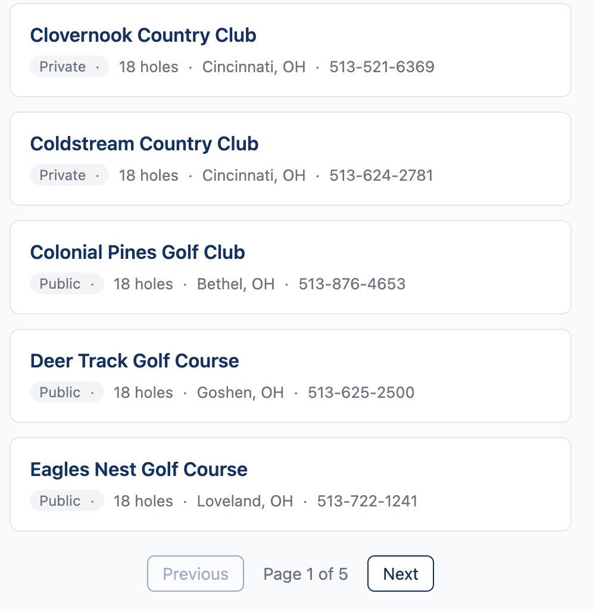

# `<club-search-results>`

Paginated golf club results panel that responds to search events. Map-agnostic — it listens for a generic `club-search` event, so any component (the county map, a future Mapbox map, or a simple form) can drive it.



## Quick Start

Add the script tag and drop in the component alongside the county map:

```html
<script src="https://ohiogolf.github.io/core-web-components/ohio-golf-core-components.js"></script>

<ohio-county-map></ohio-county-map>
<club-search-results></club-search-results>
```

Click a region on the map and matching clubs appear automatically. No wiring required — both components communicate via DOM events.

The component can also be used standalone. Dispatch a `club-search` event from your own code to trigger a search:

```html
<club-search-results></club-search-results>

<script>
  document.dispatchEvent(new CustomEvent('club-search', {
    detail: { counties: "Franklin", label: "Franklin County" },
    bubbles: true,
    composed: true,
  }));
</script>
```

## Advanced Usage

### Attributes

| Attribute | Default | Description |
|-----------|---------|-------------|
| `api-base-url` | `https://core.ohiogolf.org` | Base URL for the club search API endpoint |
| `page-size` | `20` | Number of results per page |

**Change results per page:**

```html
<club-search-results page-size="10"></club-search-results>
```

**Point to a different API:**

```html
<club-search-results api-base-url="https://staging.core.ohiogolf.org"></club-search-results>
```

### CSS Custom Properties

All styling is encapsulated by Shadow DOM. These custom properties are the only way to theme the component from the host page.

| Property | Default | Description |
|----------|---------|-------------|
| `--results-font-family` | `inherit` | Font family |
| `--results-card-border` | `1px solid #e5e7eb` | Club card border |
| `--results-card-bg` | `#ffffff` | Club card background |
| `--results-link-color` | `#003366` | Club name link color |
| `--results-status-bg` | `#f3f4f6` | Status badge background |
| `--results-spinner-color` | `#003366` | Loading spinner color |
| `--results-error-color` | `#cc3333` | Error message color |
| `--results-heading-color` | `#111827` | Results heading color |
| `--results-text-color` | `#374151` | Body text color |
| `--results-pagination-color` | `#003366` | Pagination button color |

### Events

**Listens for `club-search`** (on `document`) — Triggers a search. The component reads the event's `detail` and fetches matching clubs.

```typescript
{ counties: "Franklin", label: "Franklin County" }
// or
{ metros: "columbus", label: "Ohio Golf Association" }
```

**Dispatches `club-detail`** — Fired when a user clicks a club name. Bubbles and crosses shadow boundaries (`composed`). The component does not navigate — the host page decides what to do.

```typescript
{ clubId: 123, clubName: "Scioto Country Club" }
```

**Handle club clicks on the host page:**

```html
<script>
  document.addEventListener('club-detail', (e) => {
    window.location.href = `/clubs/${e.detail.clubId}`;
  });
</script>
```

### Data Attributes (Read-Only)

| Attribute | Values | Description |
|-----------|--------|-------------|
| `data-state` | `empty`, `loading`, `results`, `no-results`, `error` | Current component state. Use for external CSS: `club-search-results[data-state="loading"] { ... }` |

## Technical Details

### States

| State | UI |
|-------|-----|
| `empty` | "Select a county on the map to find golf clubs." |
| `loading` | Spinner with contextual message (e.g., "Searching clubs in Franklin County...") |
| `results` | Club cards with name, status badge, holes, city, phone. Pagination if multiple pages. |
| `no-results` | "No golf clubs found in Franklin County." |
| `error` | "Unable to load clubs. Please try again." with retry button |

### Accessibility

- Results announced via `aria-live="polite"` so screen readers announce when results arrive
- Error state uses `role="alert"` for immediate screen reader notification
- Pagination uses `<nav aria-label="Pagination">`

### Development

```bash
bin/setup          # Install dependencies
bin/dev            # Start dev server at http://localhost:5173
bin/test           # Run tests
```

The dev server mocks the API so the component works without a running backend. Fixture data is served from `fixtures/`. The dev page sets `api-base-url=""` to route requests to the local Vite server.
