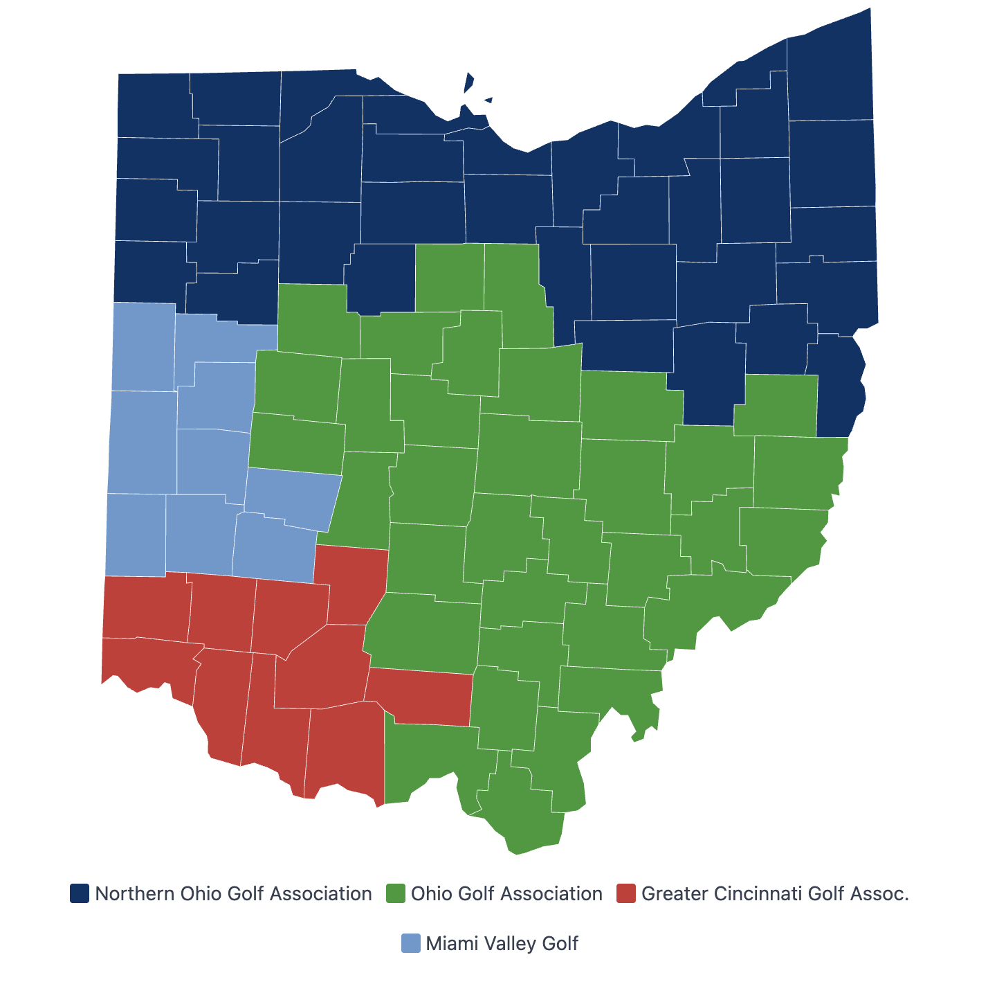

# `<ohio-county-map>`

Interactive SVG map of Ohio's 88 counties, colored by golf association region. Click a county to select its region (or just that county) and dispatch search events that can drive a results panel or anything else.



## Quick Start

Add the script tag and drop in the component — no configuration needed:

```html
<script src="https://ohiogolf.github.io/core-web-components/ohio-golf-core-components.js"></script>

<ohio-county-map></ohio-county-map>
```

The component fetches metro-to-county mappings from `core.ohiogolf.org` at runtime, so boundary changes propagate automatically without rebuilding.

Pair it with `<club-search-results>` to show matching clubs when a region is clicked:

```html
<ohio-county-map></ohio-county-map>
<club-search-results></club-search-results>
```

## Advanced Usage

### Attributes

| Attribute | Default | Description |
|-----------|---------|-------------|
| `api-base-url` | `https://core.ohiogolf.org` | Base URL for the metros API endpoint |
| `selection-mode` | `region` | `"region"` selects all counties in a region on click. `"county"` selects a single county. |
| `default-region` | — | Region ID to auto-select on load. Available: `noga`, `oga`, `gcga`, `mvg` |
| `noga-url` | USGA Get a Handicap | Override the link for the NOGA region |
| `oga-url` | GHIN Join | Override the link for the OGA region |
| `gcga-url` | GCGA Start/Select | Override the link for the GCGA region |
| `mvg-url` | MVG Join/Renew | Override the link for the MVG region |

**Pre-select a region on load** — great for association-specific pages:

```html
<ohio-county-map default-region="noga"></ohio-county-map>
```

**Switch to county-level selection:**

```html
<ohio-county-map selection-mode="county"></ohio-county-map>
```

**Point to a different API** (staging, local dev, etc.):

```html
<ohio-county-map api-base-url="https://staging.core.ohiogolf.org"></ohio-county-map>
```

**Override region links** — each region on the map and in the legend links to its organization's signup page by default. Use `{region}-url` attributes to point to different URLs:

```html
<ohio-county-map
  noga-url="https://example.com/noga-signup"
  oga-url="https://example.com/oga-signup"
  gcga-url="https://example.com/gcga-signup"
  mvg-url="https://example.com/mvg-signup">
</ohio-county-map>
```

### CSS Custom Properties

All styling is encapsulated by Shadow DOM. These custom properties are the only way to theme the component from the host page.

| Property | Default | Description |
|----------|---------|-------------|
| `--map-stroke-color` | `#ffffff` | Border color between counties |
| `--map-stroke-width` | `0.5` | Border width between counties |
| `--map-hover-opacity` | `0.8` | Opacity of the hovered county |
| `--map-muted-opacity` | `0.3` | Opacity of non-hovered counties when one is hovered |
| `--map-selected-stroke` | `#FFD700` | Stroke color for the selected county |
| `--map-selected-stroke-width` | `2.5` | Stroke width for the selected county |
| `--map-font-family` | `inherit` | Font family for the legend |
| `--map-spinner-color` | `#003366` | Loading spinner color |
| `--map-tooltip-background` | `#1f2937` | Tooltip background color |
| `--map-tooltip-color` | `#ffffff` | Tooltip text color |
| `--map-tooltip-font-size` | `0.8125rem` | Tooltip font size |
| `--map-tooltip-padding` | `0.25rem 0.5rem` | Tooltip padding |
| `--map-tooltip-border-radius` | `0.25rem` | Tooltip border radius |

### Events Dispatched

**`club-search`** — Dispatched when a county or region is selected. Bubbles and crosses shadow boundaries (`composed`).

```typescript
// Region mode (default)
{ metros: "columbus", label: "Ohio Golf Association" }

// County mode
{ counties: "Franklin", label: "Franklin County" }
```

**`county-selected`** — Dispatched alongside `club-search`. Intended for host page use (URL sync, analytics, etc.).

```typescript
{ county: "Franklin", regionId: "oga", regionName: "Ohio Golf Association" }
```

### Data Attributes (Read-Only)

| Attribute | Values | Description |
|-----------|--------|-------------|
| `data-state` | `loading`, `ready`, `error` | Current component state. Use for external CSS: `ohio-county-map[data-state="loading"] { ... }` |

## Technical Details

### Behavior

**Region mode (default):**
- **Hover:** highlights all counties in the hovered region, mutes the rest
- **Click:** selects all counties in the region with a gold stroke, dispatches events. Clicking another county in the same region is a no-op.
- **Keyboard:** counties are focusable with Tab. Enter or Space to select.

**County mode** (`selection-mode="county"`):
- **Hover:** highlights the hovered county, mutes all others
- **Click:** selects a single county with a gold stroke, dispatches events. Clicking the same county again is a no-op.
- **Keyboard:** counties are focusable with Tab. Enter or Space to select.

**Both modes:**
- Shows a spinner while fetching metro data
- Shows a retry message if the fetch fails
- Displays a legend with all four golf association regions

### Accessibility

- SVG has `role="img"` with a descriptive `aria-label`
- Each county path has `role="button"`, `tabindex="0"`, and an `aria-label` like "Franklin County, Ohio Golf Association"
- Keyboard navigation with Tab, selection with Enter/Space
- Focus outlines visible on keyboard navigation

### Development

```bash
bin/setup          # Install dependencies
bin/dev            # Start dev server at http://localhost:5173
bin/test           # Run tests
```

The dev server mocks the API so the component works without a running backend. Fixture data is served from `fixtures/`. The dev page sets `api-base-url=""` to route requests to the local Vite server.

**SVG map data:** `src/data/ohio-counties.ts` contains pre-computed SVG path strings for all 88 counties, generated from Census TIGER boundaries. Regenerate with `npm run generate-svg` if boundary data ever updates.
